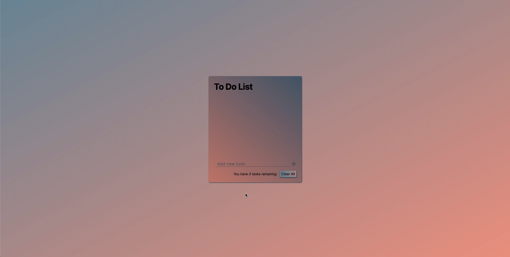

# todo-list-react

## Description

- Create a todo list.

## Features

- Users can add, edit, and clear todos.
- Users can access their todo list again through local storage.

## Demo

## Link

Live-site URL:

## My Process

### Built With

- React

## What I Learned/Applied

- Local Storage
- React props, states, forms, events.

## Updates

- Upon user request, added functionality to edit an existing todo.
